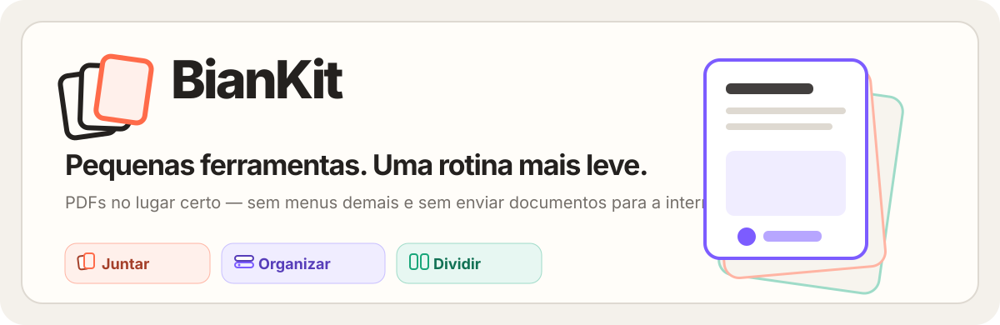
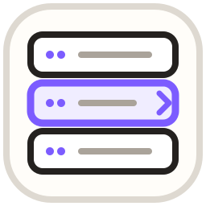
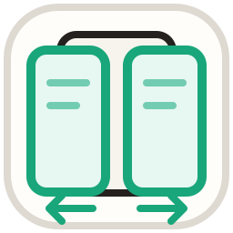

<p align="center">
  
</p>

<p align="center">
  <strong>Três aplicativos pequenos. Uma tarefa em cada um. Nenhuma instalação.</strong><br>
  Feito para acompanhar a rotina da Bianka no escritório e nas aulas de inglês.
</p>

<p align="center">
  <a href="https://github.com/RY0UK3N/Biankit/releases/latest"><strong>Baixar a versão mais recente</strong></a>
</p>

---

## Escolha o que precisa fazer

<table>
  <tr>
    <td width="33%"><h3> BianKit Juntar</h3></td>
    <td width="33%"><h3> BianKit Organizar</h3></td>
    <td width="33%"><h3> BianKit Dividir</h3></td>
  </tr>
  <tr>
    <td valign="top">Coloque vários PDFs na ordem desejada e transforme tudo em um único documento.</td>
    <td valign="top">Reordene, gire ou remova páginas olhando diretamente para as miniaturas.</td>
    <td valign="top">Separe cada página ou escolha intervalos para criar novos documentos.</td>
  </tr>
  <tr>
    <td valign="top"><strong>Bom para:</strong> materiais de aula, relatórios e anexos recebidos separadamente.</td>
    <td valign="top"><strong>Bom para:</strong> digitalizações fora de ordem e páginas que ficaram de lado.</td>
    <td valign="top"><strong>Bom para:</strong> atividades individuais e partes específicas de um PDF.</td>
  </tr>
  <tr>
    <td><a href="https://github.com/RY0UK3N/Biankit/releases/download/v0.2.6/BianKit-Juntar-0.2.6.exe"><strong>Baixar Juntar</strong></a></td>
    <td><a href="https://github.com/RY0UK3N/Biankit/releases/download/v0.2.6/BianKit-Organizar-0.2.6.exe"><strong>Baixar Organizar</strong></a></td>
    <td><a href="https://github.com/RY0UK3N/Biankit/releases/download/v0.2.6/BianKit-Dividir-0.2.6.exe"><strong>Baixar Dividir</strong></a></td>
  </tr>
</table>

## Arraste, ajuste, salve

1. Abra somente o aplicativo da tarefa que deseja realizar.
2. Arraste o PDF diretamente do Explorer para a janela.
3. Confira o resultado, escolha onde salvar e pronto.

Os aplicativos são portáteis: podem ficar juntos em uma pasta ou pendrive e não precisam ser instalados.

> **Seus documentos continuam seus.** Todo o processamento acontece no computador. Nenhum PDF é enviado para a internet, o arquivo original não é alterado e o resultado sempre é salvo como uma nova cópia.

## Uma janelinha que acompanha o trabalho

O BianKit foi pensado para ficar ao lado do Explorer enquanto os documentos são encontrados:

- **Fixado** mantém a janela compacta em primeiro plano.
- **Livre** permite trabalhar normalmente com outras janelas.
- O **Organizar** pode ser maximizado para mostrar mais páginas; nesse modo, a fixação é pausada automaticamente.

## Versão atual

**BianKit 0.2.6 · Windows 64 bits · Juntar, Organizar e Dividir**

Os três aplicativos possuem ícones próprios e testes para as operações principais. Como os executáveis ainda não têm assinatura digital de uma autoridade certificadora, o Windows pode exibir um aviso de segurança ao abri-los pela primeira vez.

## Licença

O BianKit é disponibilizado sob a **MIT License**. Você pode usar, copiar,
modificar, distribuir, sublicenciar e vender cópias do software, desde que o
aviso de copyright e o texto da licença sejam mantidos.

Os PDFs produzidos com o BianKit pertencem integralmente a quem os criou.

Os termos completos estão em [LICENSE.md](LICENSE.md). As bibliotecas utilizadas e suas respectivas licenças estão em [avisos de terceiros](legal/THIRD_PARTY_NOTICES.txt).

<details>
<summary><strong>Informações para desenvolvimento</strong></summary>

### Ambiente

Requer Node.js 22 ou superior.

```powershell
npm install
npm run dev:merge
npm run dev:organize
npm run dev:split
```

### Testes e empacotamento

```powershell
npm test
npm run build
```

Os executáveis são gerados em `release/`. Essa pasta e `node_modules/` não são versionadas.

### Arquitetura preparada para novos apps

O catálogo central fica em `src/tool-catalog.json`. Projetos futuros permanecem com `enabled: false` até que operação, interface, testes e empacotamento estejam completos.

- [Princípios do produto](docs/PRODUCT_PRINCIPLES.md)

Principais diretórios:

- `src/main.js` — janelas, diálogos, arquivos e comunicação segura.
- `src/pdf-operations.js` — operações testáveis sobre PDFs.
- `src/renderer/` — interface compartilhada.
- `scripts/` — desenvolvimento e geração dos portáteis.
- `test/` — testes funcionais.

</details>

## Tecnologias e revisão

O projeto utiliza **JavaScript**, **HTML** e **CSS**, com **Electron** para os aplicativos portáteis, **pdf-lib** para manipular documentos e **PDF.js** para exibir as páginas. Os códigos-fonte estão organizados em [`src/`](src/), [`scripts/`](scripts/) e [`test/`](test/).

A revisão desta versão contou com **assistência de IA (Codex/OpenAI)**, acompanhados de revisão humana e testes automatizados das operações principais.

---

<p align="center">
  Feito com carinho para a Bianka. 💜<br>
  <sub>Copyright © 2026 Marcos Luciano Tagliari Junior · Uso sujeito aos termos de LICENSE.md.</sub>
</p>
